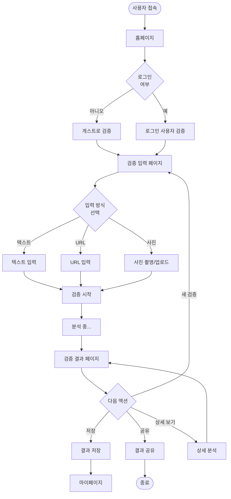

# FactChecker - 와이어프레임

**버전**: 1.0  
**작성일**: 2026년 1월 22일

---

## 목차

1. [개요](#개요)
2. [사용자 플로우](#사용자-플로우)
3. [홈페이지](#홈페이지)
4. [검증 입력 페이지](#검증-입력-페이지)
5. [검증 결과 페이지](#검증-결과-페이지)
6. [공통 컴포넌트](#공통-컴포넌트)
7. [구현 가이드](#구현-가이드)

---

## 개요

이 문서는 FactChecker MVP의 핵심 사용자 플로우에 대한 와이어프레임을 제공합니다.

### 대상 페이지
- 홈페이지 (메인 랜딩)
- 검증 입력 페이지 (텍스트/URL/사진)
- 검증 결과 페이지 (신뢰도 평가 + 상세 분석)

### 디자인 원칙
- **모바일 퍼스트**: 모바일에서 먼저 동작하도록 설계
- **명확성**: 사용자가 쉽게 이해할 수 있는 인터페이스
- **접근성**: WCAG 2.1 AA 기준 준수

### 관련 문서
- [디자인 가이드](./design-guide.md) - 색상, 타이포그래피, 컴포넌트 스타일
- [기술 사양서](./technical-specs.md) - API 및 데이터 구조

---

## 사용자 플로우



---

## 홈페이지

### 목적
- 서비스 소개 및 빠른 검증 시작
- 신규 사용자 유치 및 기존 사용자 편의성 제공

### 데스크톱 레이아웃 (> 1024px)

```
┌─────────────────────────────────────────────────────────┐
│  Header                                                  │
│  [Logo] FactChecker         [로그인] [회원가입]          │
└─────────────────────────────────────────────────────────┘
│                                                           │
│                    Hero Section                           │
│                                                           │
│              정보의 신뢰도를 확인하세요                      │
│        AI 기반 정보 검증 지원 서비스 FactChecker            │
│                                                           │
│  ┌───────────────────────────────────────────────────┐  │
│  │  [탭: 텍스트] [탭: URL] [탭: 사진]                 │  │
│  │                                                     │  │
│  │  ┌─────────────────────────────────────────────┐  │  │
│  │  │  검증하고 싶은 내용을 입력하세요...          │  │  │
│  │  │                                              │  │  │
│  │  │                                              │  │  │
│  │  └─────────────────────────────────────────────┘  │  │
│  │                                                     │  │
│  │               [검증 시작하기]                        │  │
│  └───────────────────────────────────────────────────┘  │
│                                                           │
│                  또는 예시로 시작하기                       │
│          "하루 물 8잔은 건강에 필수적이다"                  │
│                                                           │
├───────────────────────────────────────────────────────────┤
│                                                           │
│                  주요 기능 소개                            │
│                                                           │
│  ┌──────────────┐  ┌──────────────┐  ┌──────────────┐  │
│  │    [아이콘]   │  │    [아이콘]   │  │    [아이콘]   │  │
│  │              │  │              │  │              │  │
│  │  다양한 입력  │  │  AI 기반 분석 │  │  투명한 출처  │  │
│  │              │  │              │  │              │  │
│  │  텍스트, URL  │  │  GPT-4 활용  │  │  모든 근거    │  │
│  │  사진 지원    │  │  빠른 검증   │  │  공개         │  │
│  └──────────────┘  └──────────────┘  └──────────────┘  │
│                                                           │
├───────────────────────────────────────────────────────────┤
│                                                           │
│                  최근 검증 결과                            │
│                  (로그인 사용자만)                         │
│                                                           │
│  ┌────────────────────────────────────────────────────┐  │
│  │  "플라스틱 빨대 금지..." [🟢 신뢰함]  2024.01.20    │  │
│  └────────────────────────────────────────────────────┘  │
│  ┌────────────────────────────────────────────────────┐  │
│  │  "하루 물 8잔..."        [🟡 주의 필요] 2024.01.19  │  │
│  └────────────────────────────────────────────────────┘  │
│                                                           │
└───────────────────────────────────────────────────────────┘
│  Footer                                                   │
│  FactChecker © 2026 | 이용약관 | 개인정보처리방침 | 문의  │
└───────────────────────────────────────────────────────────┘
```

### 모바일 레이아웃 (< 640px)

```
┌─────────────────────────┐
│  Header                 │
│  [☰] FactChecker  [👤]  │
└─────────────────────────┘
│                         │
│    정보의 신뢰도를       │
│      확인하세요         │
│                         │
│  AI 기반 정보 검증 지원  │
│                         │
│  ┌───────────────────┐  │
│  │ [텍스트] [URL]    │  │
│  │ [사진]            │  │
│  └───────────────────┘  │
│                         │
│  ┌───────────────────┐  │
│  │ 검증하고 싶은     │  │
│  │ 내용을 입력...    │  │
│  │                   │  │
│  └───────────────────┘  │
│                         │
│    [검증 시작하기]       │
│                         │
│   예시로 시작하기        │
│   "하루 물 8잔..."      │
│                         │
├─────────────────────────┤
│   주요 기능              │
│                         │
│  [아이콘]               │
│  다양한 입력 방식        │
│                         │
│  [아이콘]               │
│  AI 기반 빠른 분석       │
│                         │
│  [아이콘]               │
│  투명한 출처 공개        │
│                         │
└─────────────────────────┘
│  Footer                 │
└─────────────────────────┘
```

### 컴포넌트 계층 구조

```
HomePage
├── Header
│   ├── Logo
│   ├── Navigation
│   │   ├── LoginButton
│   │   └── SignupButton
│   └── MobileMenu (모바일만)
├── HeroSection
│   ├── Heading
│   ├── Subheading
│   └── QuickVerifyForm
│       ├── InputTypeTabs
│       ├── InputField (동적)
│       └── SubmitButton
├── ExampleSection
│   └── ExampleCard
├── FeaturesSection
│   └── FeatureCard[] (3개)
├── RecentVerifications (로그인 시)
│   └── VerificationCard[]
└── Footer
    ├── Copyright
    └── Links
```

### 상태 및 인터랙션

#### 초기 상태
- QuickVerifyForm의 기본 탭: 텍스트
- 로그인하지 않은 경우: Header에 로그인/회원가입 버튼
- 로그인한 경우: Header에 사용자 아이콘, 최근 검증 결과 표시

#### 탭 전환
```
[텍스트] 선택 → Textarea 표시
[URL] 선택 → URL Input 표시
[사진] 선택 → 파일 업로드 버튼 또는 카메라 버튼
```

#### 검증 시작
- 입력 검증 (최소 10자 이상)
- 버튼 비활성화 → 로딩 상태
- 검증 입력 페이지로 이동 (또는 즉시 분석 시작)

---

## 검증 입력 페이지

### 목적
- 사용자가 다양한 방식으로 검증할 내용 입력
- 입력 내용 확인 및 수정 기회 제공

### 데스크톱 레이아웃

```
┌─────────────────────────────────────────────────────────┐
│  Header                                                  │
│  [← 뒤로] FactChecker                      [프로필]      │
└─────────────────────────────────────────────────────────┘
│                                                           │
│                   정보 검증하기                            │
│                                                           │
│  ┌───────────────────────────────────────────────────┐  │
│  │  입력 방식 선택                                     │  │
│  │                                                     │  │
│  │  ┌─────────┐  ┌─────────┐  ┌─────────┐           │  │
│  │  │  텍스트  │  │  URL    │  │  사진   │           │  │
│  │  │  [📝]    │  │  [🔗]   │  │  [📷]   │           │  │
│  │  └─────────┘  └─────────┘  └─────────┘           │  │
│  │                                                     │  │
│  └───────────────────────────────────────────────────┘  │
│                                                           │
│  ┌───────────────────────────────────────────────────┐  │
│  │  입력 내용                                          │  │
│  │                                                     │  │
│  │  [선택된 입력 방식에 따른 인터페이스]                │  │
│  │                                                     │  │
│  │  ┌─────────────────────────────────────────────┐  │  │
│  │  │  검증하고 싶은 내용을 입력하세요              │  │  │
│  │  │                                              │  │  │
│  │  │                                              │  │  │
│  │  │                                              │  │  │
│  │  │                                              │  │  │
│  │  │                                              │  │  │
│  │  └─────────────────────────────────────────────┘  │  │
│  │                                                     │  │
│  │  0 / 2,000자                                        │  │
│  │                                                     │  │
│  └───────────────────────────────────────────────────┘  │
│                                                           │
│  ┌───────────────────────────────────────────────────┐  │
│  │  💡 팁                                              │  │
│  │  - 구체적인 주장일수록 정확한 검증이 가능합니다    │  │
│  │  - 여러 주장은 나누어 검증하는 것을 권장합니다     │  │
│  └───────────────────────────────────────────────────┘  │
│                                                           │
│                  [취소]    [검증 시작]                    │
│                                                           │
└───────────────────────────────────────────────────────────┘
```

### 모바일 레이아웃

```
┌─────────────────────────┐
│  [←] 정보 검증하기  [👤] │
└─────────────────────────┘
│                         │
│  입력 방식 선택          │
│                         │
│  [📝 텍스트]            │
│  [🔗 URL]               │
│  [📷 사진]              │
│                         │
├─────────────────────────┤
│                         │
│  ┌───────────────────┐  │
│  │ 검증하고 싶은     │  │
│  │ 내용을 입력하세요 │  │
│  │                   │  │
│  │                   │  │
│  │                   │  │
│  │                   │  │
│  └───────────────────┘  │
│  0 / 2,000자            │
│                         │
├─────────────────────────┤
│  💡 팁                  │
│  구체적인 주장일수록    │
│  정확한 검증 가능       │
└─────────────────────────┘
│                         │
│  [취소]  [검증 시작]    │
│                         │
└─────────────────────────┘
```

### 컴포넌트 계층 구조

```
VerifyInputPage
├── Header
│   ├── BackButton
│   ├── Title
│   └── ProfileIcon
├── InputTypeSelector
│   ├── TextInputOption
│   ├── URLInputOption
│   └── PhotoInputOption
├── InputContainer
│   ├── TextInput (텍스트 선택 시)
│   │   ├── Textarea
│   │   └── CharacterCount
│   ├── URLInput (URL 선택 시)
│   │   ├── Input
│   │   └── ValidationMessage
│   └── PhotoInput (사진 선택 시)
│       ├── FileUploadButton
│       ├── CameraButton
│       └── PreviewImage
├── TipsCard
└── ActionButtons
    ├── CancelButton
    └── SubmitButton
```

### 입력 방식별 인터페이스

#### 1. 텍스트 입력

```
┌─────────────────────────────────────────┐
│  텍스트 직접 입력                        │
│                                         │
│  ┌────────────────────────────────────┐ │
│  │  예: "하루 물 8잔을 마시는 것이    │ │
│  │  건강에 필수적이다"                │ │
│  │                                    │ │
│  │                                    │ │
│  │                                    │ │
│  └────────────────────────────────────┘ │
│  127 / 2,000자                          │
│                                         │
│  ✓ 10자 이상 입력                       │
└─────────────────────────────────────────┘
```

#### 2. URL 입력

```
┌─────────────────────────────────────────┐
│  URL 입력                                │
│                                         │
│  ┌────────────────────────────────────┐ │
│  │  https://example.com/article       │ │
│  └────────────────────────────────────┘ │
│                                         │
│  ℹ️ 블로그, 뉴스 기사 등의 URL을        │
│     입력하세요                          │
│                                         │
│  ⚠️ 로그인이 필요한 페이지는 제외       │
└─────────────────────────────────────────┘
```

#### 3. 사진 입력

```
┌─────────────────────────────────────────┐
│  사진으로 검증                           │
│                                         │
│  ┌────────────────────────────────────┐ │
│  │        [📷 사진 촬영]               │ │
│  │                                    │ │
│  │        [📁 파일 선택]               │ │
│  └────────────────────────────────────┘ │
│                                         │
│  💡 명확한 인쇄물을 촬영하세요          │
│     (책, 신문, 문서 등)                 │
│                                         │
│  지원 형식: JPG, PNG (최대 5MB)         │
└─────────────────────────────────────────┘
```

### 상태 및 인터랙션

#### 입력 검증
```javascript
// 텍스트
- 최소 10자 이상
- 최대 2,000자
- 비어있으면 검증 버튼 비활성화

// URL
- 올바른 URL 형식 (http:// 또는 https://)
- 유효성 검증 (실시간)

// 사진
- 파일 크기 5MB 이하
- 지원 형식: JPG, PNG, WebP
- 미리보기 표시
```

#### 검증 시작 플로우
```
1. 입력 검증 통과
2. 버튼 클릭 → 로딩 상태
3. 서버로 데이터 전송
4. 분석 진행 화면으로 전환
5. 결과 페이지로 이동
```

#### 분석 중 화면

```
┌─────────────────────────┐
│                         │
│     [로딩 애니메이션]    │
│                         │
│    정보를 분석 중입니다  │
│                         │
│    예상 대기 시간: 1-2분 │
│                         │
│    ████████░░░░ 60%     │
│                         │
├─────────────────────────┤
│  💡 잠깐만요!           │
│                         │
│  AI의 판단은 참고용이며  │
│  최종 판단은 사용자의    │
│  몫입니다               │
└─────────────────────────┘
```

---

## 검증 결과 페이지

### 목적
- 검증 결과를 명확하게 제시
- 근거 자료 및 추가 정보 제공
- 사용자 액션 (저장, 공유) 지원

### 데스크톱 레이아웃

```
┌─────────────────────────────────────────────────────────┐
│  Header                                                  │
│  [← 뒤로] FactChecker                [저장] [공유] [👤] │
└─────────────────────────────────────────────────────────┘
│                                                           │
│                    검증 결과                              │
│                                                           │
│  ┌───────────────────────────────────────────────────┐  │
│  │  검증한 내용                                        │  │
│  │  "하루 물 8잔을 마시는 것이 건강에 필수적이다"      │  │
│  └───────────────────────────────────────────────────┘  │
│                                                           │
│  ┌───────────────────────────────────────────────────┐  │
│  │                                                     │  │
│  │              🟡 주의 필요                           │  │
│  │                                                     │  │
│  │  이는 널리 알려진 속설이나 과학적 근거는            │  │
│  │  제한적입니다. 실제 필요량은 개인의 체중,           │  │
│  │  활동량, 환경에 따라 다릅니다.                      │  │
│  │                                                     │  │
│  └───────────────────────────────────────────────────┘  │
│                                                           │
│  ⚠️ AI의 판단은 참고용이며, 최종 판단은 사용자의 몫입니다 │
│                                                           │
├───────────────────────────────────────────────────────────┤
│                                                           │
│  [탭: AI 분석] [탭: 근거 자료] [탭: 관련 자료]           │
│                                                           │
│  ┌───────────────────────────────────────────────────┐  │
│  │  AI 분석 내용                                       │  │
│  │                                                     │  │
│  │  📌 주요 논점                                       │  │
│  │  • "하루 물 8잔"이 건강에 필수적인가?               │  │
│  │                                                     │  │
│  │  🔍 발견된 정보                                     │  │
│  │  • 1945년 미국 식품영양위원회 권장사항에서 유래     │  │
│  │  • 최근 연구는 개인별 필요량이 다름을 강조          │  │
│  │  • 음식을 통한 수분 섭취도 포함되어야 함            │  │
│  │                                                     │  │
│  │  ⚠️ 한계점                                          │  │
│  │  • 특정 질병이나 상황에서는 다를 수 있음            │  │
│  │  • 의학적 조언이 필요한 경우 전문가 상담 권장       │  │
│  └───────────────────────────────────────────────────┘  │
│                                                           │
└───────────────────────────────────────────────────────────┘
│                                                           │
│  ┌───────────────────────────────────────────────────┐  │
│  │  📚 근거 자료 (3개)                                │  │
│  │                                                     │  │
│  │  ┌─────────────────────────────────────────────┐  │  │
│  │  │  학술지                                       │  │  │
│  │  │  "수분 섭취와 건강에 관한 최신 연구"          │  │  │
│  │  │  대한의학회지, 2025                           │  │  │
│  │  │                                              │  │  │
│  │  │  📖 국립중앙도서관 소장                       │  │  │
│  │  │  [원문 링크] [도서관 정보 보기]               │  │  │
│  │  └─────────────────────────────────────────────┘  │  │
│  │                                                     │  │
│  │  ┌─────────────────────────────────────────────┐  │  │
│  │  │  정부기관                                     │  │  │
│  │  │  "건강한 수분 섭취 가이드"                    │  │  │
│  │  │  보건복지부, 2024                             │  │  │
│  │  │                                              │  │  │
│  │  │  [원문 링크]                                  │  │  │
│  │  └─────────────────────────────────────────────┘  │  │
│  └───────────────────────────────────────────────────┘  │
│                                                           │
│            [새로운 검증 하기]  [결과 수정 요청]           │
│                                                           │
└───────────────────────────────────────────────────────────┘
```

### 모바일 레이아웃

```
┌─────────────────────────┐
│  [←] 검증 결과          │
│  [저장] [공유]          │
└─────────────────────────┘
│                         │
│  검증한 내용             │
│  "하루 물 8잔..."       │
│                         │
├─────────────────────────┤
│                         │
│     🟡 주의 필요        │
│                         │
│  널리 알려진 속설이나   │
│  과학적 근거는 제한적   │
│  ...                    │
│                         │
├─────────────────────────┤
│  ⚠️ AI 판단은 참고용    │
└─────────────────────────┘
│                         │
│  [AI 분석] [근거 자료]  │
│  [관련 자료]            │
│                         │
│  📌 주요 논점           │
│  • 하루 물 8잔이...     │
│                         │
│  🔍 발견된 정보         │
│  • 1945년 권장사항...   │
│                         │
├─────────────────────────┤
│  📚 근거 자료 (3개)     │
│                         │
│  ┌───────────────────┐  │
│  │ 학술지             │  │
│  │ "수분 섭취와..."   │  │
│  │ 대한의학회지, 2025 │  │
│  │                   │  │
│  │ 📖 국립중앙도서관  │  │
│  │ [원문] [도서관]    │  │
│  └───────────────────┘  │
│                         │
├─────────────────────────┤
│  [새로운 검증 하기]     │
│  [결과 수정 요청]       │
└─────────────────────────┘
```

### 컴포넌트 계층 구조

```
ResultPage
├── Header
│   ├── BackButton
│   ├── Title
│   └── Actions
│       ├── SaveButton
│       ├── ShareButton
│       └── ProfileIcon
├── QuerySection
│   └── QueryText
├── TrustLevelSection
│   ├── TrustBadge (신뢰함/주의/의심스러움)
│   └── SummaryText
├── DisclaimerBanner
├── ContentTabs
│   ├── AnalysisTab
│   │   ├── MainClaimsSection
│   │   ├── FindingsSection
│   │   └── LimitationsSection
│   ├── SourcesTab
│   │   └── SourceCard[]
│   │       ├── SourceType
│   │       ├── Title
│   │       ├── Publisher
│   │       ├── Date
│   │       ├── LibraryInfo
│   │       └── Links
│   └── RelatedTab
│       └── RelatedArticleCard[]
└── ActionButtons
    ├── NewVerifyButton
    └── FeedbackButton
```

### 신뢰도 배지 디자인

#### 🟢 신뢰함 (Trusted)

```
┌─────────────────────────────────────┐
│                                     │
│          ✓  신뢰함                  │
│                                     │
│  신뢰할 수 있는 출처가 여러 개       │
│  확인되었습니다.                    │
│                                     │
└─────────────────────────────────────┘
배경: 연한 초록색 (#dcfce7)
텍스트: 진한 초록색 (#166534)
아이콘: ✓
```

#### 🟡 주의 필요 (Caution)

```
┌─────────────────────────────────────┐
│                                     │
│          ⚠️  주의 필요              │
│                                     │
│  일부 출처만 확인되거나 상충하는     │
│  정보가 존재합니다.                 │
│                                     │
└─────────────────────────────────────┘
배경: 연한 노란색 (#fef3c7)
텍스트: 진한 노란색 (#854d0e)
아이콘: ⚠️
```

#### 🔴 의심스러움 (Suspicious)

```
┌─────────────────────────────────────┐
│                                     │
│          ✕  의심스러움              │
│                                     │
│  신뢰할 수 있는 출처를 찾기          │
│  어렵거나 반박 자료가 다수입니다.    │
│                                     │
└─────────────────────────────────────┘
배경: 연한 빨간색 (#fee2e2)
텍스트: 진한 빨간색 (#991b1b)
아이콘: ✕
```

### 탭 전환 인터랙션

```javascript
초기 상태: [AI 분석] 활성

클릭 시:
1. 선택된 탭 강조 (하단 border)
2. 콘텐츠 영역 부드럽게 전환 (fade)
3. 탭 제목 굵게 표시
```

### 출처 카드 상세

```
┌───────────────────────────────────────────────┐
│  [출처 유형 배지: 학술지]                      │
│                                               │
│  수분 섭취와 건강에 관한 최신 연구              │
│  대한의학회지, 2025년 3월                      │
│                                               │
│  AI가 이 출처를 참고한 이유:                    │
│  "최신 의학 연구로 개인별 수분 필요량이         │
│  다양함을 과학적으로 제시"                     │
│                                               │
│  📖 도서관 정보                                │
│  ┌───────────────────────────────────────┐    │
│  │  • 국립중앙도서관 소장                 │    │
│  │  • ISSN: 1234-5678                    │    │
│  │  [도서관 홈페이지 바로가기]            │    │
│  └───────────────────────────────────────┘    │
│                                               │
│  [🔗 원문 보기]                               │
└───────────────────────────────────────────────┘
```

### 저장 및 공유 기능

#### 저장 다이얼로그

```
┌─────────────────────────┐
│  결과 저장하기           │
│                         │
│  폴더 선택:              │
│  ┌───────────────────┐  │
│  │ 건강 정보 ▼       │  │
│  └───────────────────┘  │
│                         │
│  또는 새 폴더 만들기:    │
│  ┌───────────────────┐  │
│  │                   │  │
│  └───────────────────┘  │
│                         │
│  [취소]     [저장]      │
└─────────────────────────┘
```

#### 공유 옵션

```
┌─────────────────────────┐
│  결과 공유하기           │
│                         │
│  ┌───────────────────┐  │
│  │ 링크 복사         │  │
│  └───────────────────┘  │
│                         │
│  ┌───────────────────┐  │
│  │ 카카오톡          │  │
│  └───────────────────┘  │
│                         │
│  ┌───────────────────┐  │
│  │ 트위터            │  │
│  └───────────────────┘  │
│                         │
│  [취소]                 │
└─────────────────────────┘
```

---

## 공통 컴포넌트

### Header

#### 데스크톱

```
┌─────────────────────────────────────────────────────────┐
│  [Logo] FactChecker         [로그인] [회원가입]          │
└─────────────────────────────────────────────────────────┘

로그인 후:
┌─────────────────────────────────────────────────────────┐
│  [Logo] FactChecker              [알림] [프로필 아이콘]  │
└─────────────────────────────────────────────────────────┘
```

#### 모바일

```
┌─────────────────────────┐
│  [☰] FactChecker  [👤]  │
└─────────────────────────┘

메뉴 열림:
┌─────────────────────────┐
│  [✕] 메뉴               │
├─────────────────────────┤
│  홈                      │
│  내 검증 결과            │
│  마이페이지              │
│  설정                    │
│  로그아웃                │
└─────────────────────────┘
```

### Footer

```
┌───────────────────────────────────────────────┐
│  FactChecker © 2026                           │
│  도서관 이용자를 위한 정보 검증 지원 서비스    │
│                                               │
│  이용약관 | 개인정보처리방침 | FAQ | 문의     │
│                                               │
│  [GitHub] [Twitter]                           │
└───────────────────────────────────────────────┘
```

### 버튼 스타일

```
Primary Button:
┌───────────────┐
│  검증 시작     │  ← 배경: Primary 컬러, 흰색 텍스트
└───────────────┘

Secondary Button:
┌───────────────┐
│  취소          │  ← 테두리만, 회색 텍스트
└───────────────┘

Outline Button:
┌───────────────┐
│  더 알아보기   │  ← 테두리만, Primary 컬러 텍스트
└───────────────┘
```

### 입력 필드

```
┌─────────────────────────────────┐
│  검증하고 싶은 내용을 입력하세요  │
└─────────────────────────────────┘

포커스 시:
┌─────────────────────────────────┐ ← Primary 컬러 테두리
│  검증하고 싶은 내용을 입력하세요 |
└─────────────────────────────────┘

에러 시:
┌─────────────────────────────────┐ ← 빨간색 테두리
│  최소 10자 이상 입력해주세요      │
└─────────────────────────────────┘
⚠️ 최소 10자 이상 입력해주세요
```

### 로딩 상태

```
검증 진행 중:

     ⏳
  분석 중입니다...
  
  예상 시간: 1-2분
  
  ████████░░░░ 60%
```

### 에러 상태

```
┌─────────────────────────────────┐
│  ❌ 오류가 발생했습니다           │
│                                 │
│  일시적인 문제가 발생했습니다.   │
│  잠시 후 다시 시도해주세요.      │
│                                 │
│  [다시 시도]                     │
└─────────────────────────────────┘
```

---

## 구현 가이드

### React 컴포넌트 매핑

#### 홈페이지

```typescript
// app/(main)/page.tsx
export default function HomePage() {
  return (
    <div className="min-h-screen">
      <Header />
      <HeroSection />
      <FeaturesSection />
      <RecentVerifications />
      <Footer />
    </div>
  );
}

// components/home/HeroSection.tsx
export function HeroSection() {
  return (
    <section className="py-20 px-4">
      <h1 className="text-5xl font-bold text-center">
        정보의 신뢰도를 확인하세요
      </h1>
      <QuickVerifyForm />
    </section>
  );
}
```

#### 검증 입력 페이지

```typescript
// app/(main)/verify/page.tsx
export default function VerifyInputPage() {
  const [inputType, setInputType] = useState('text');
  
  return (
    <div className="min-h-screen">
      <Header />
      <InputTypeSelector 
        selected={inputType} 
        onChange={setInputType} 
      />
      {inputType === 'text' && <TextInput />}
      {inputType === 'url' && <URLInput />}
      {inputType === 'photo' && <PhotoInput />}
    </div>
  );
}
```

#### 검증 결과 페이지

```typescript
// app/(main)/verify/[id]/page.tsx
export default function ResultPage({ params }: { params: { id: string } }) {
  const { data } = useVerification(params.id);
  
  return (
    <div className="min-h-screen">
      <Header />
      <TrustLevelSection level={data.trustLevel} />
      <Tabs defaultValue="analysis">
        <TabsList>
          <TabsTrigger value="analysis">AI 분석</TabsTrigger>
          <TabsTrigger value="sources">근거 자료</TabsTrigger>
        </TabsList>
      </Tabs>
    </div>
  );
}
```

### TailwindCSS 예시

```typescript
// 신뢰도 배지
<div className={cn(
  "rounded-lg p-6 text-center",
  level === 'trusted' && "bg-green-50 text-green-800",
  level === 'caution' && "bg-yellow-50 text-yellow-800",
  level === 'suspicious' && "bg-red-50 text-red-800"
)}>
  {level === 'trusted' && '✓ 신뢰함'}
  {level === 'caution' && '⚠️ 주의 필요'}
  {level === 'suspicious' && '✕ 의심스러움'}
</div>

// 버튼
<button className="bg-blue-600 hover:bg-blue-700 text-white px-6 py-3 rounded-lg font-medium transition">
  검증 시작
</button>

// 입력 필드
<textarea 
  className="w-full border border-gray-300 focus:border-blue-500 focus:ring-2 focus:ring-blue-200 rounded-lg p-4"
  placeholder="검증하고 싶은 내용을 입력하세요"
/>
```

### 반응형 구현 팁

```typescript
// 모바일 퍼스트
<div className="
  grid grid-cols-1 gap-4
  md:grid-cols-2
  lg:grid-cols-3
">
  {/* 카드들 */}
</div>

// 조건부 렌더링
<div className="hidden md:block">
  {/* 데스크톱에서만 표시 */}
</div>

<div className="md:hidden">
  {/* 모바일에서만 표시 */}
</div>
```

### 접근성 가이드

```typescript
// 키보드 네비게이션
<button
  type="button"
  aria-label="검증 시작하기"
  className="..."
>
  검증 시작
</button>

// 스크린 리더
<div role="alert" aria-live="polite">
  분석이 완료되었습니다
</div>

// 포커스 표시
<input 
  className="focus:ring-2 focus:ring-blue-500 focus:outline-none"
/>
```

---

**문서 끝**

이 와이어프레임은 개발자가 바로 구현할 수 있도록 상세하게 작성되었습니다. 실제 구현 시 디자인 가이드와 함께 참고하세요.
